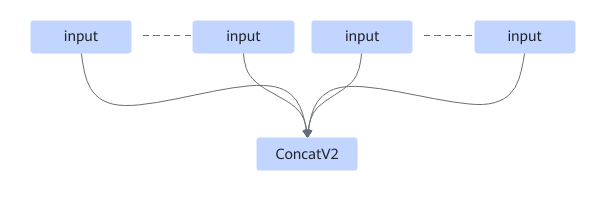

# ZConcatExt2FusionPass

## 融合模式

该融合规则将ConcatV2算子的多个输入拆分成多个ConcatV2D，根据实际输入个数，按照一定计算规则确定融合后ConcatV2D个数。

融合成

## 使用约束

- 当输入为静态场景时，ConcatV2单算子编译个数最大为63个。
- 当输入为动态shape时，ConcatV2单算子编译个数最大为48个。
- 在二进制场景下， ConcatV2单算子编译个数最大为32个。
- 输入的数据类型不支持complex64/complex128/double。
- 默认不可关闭。

## 支持的型号

<!-- npu="910b" id1 -->
Atlas A2 训练系列产品/Atlas A2 推理系列产品
<!-- end id1 -->
