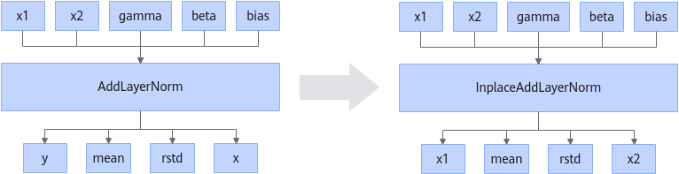

# ZInplaceAddLayerNormFusionPass

## 融合模式

将AddLayerNorm的y输出地址复用x1输入地址，x输出地址复用x2输入地址，转换为InplaceAddLayerNorm算子。

## 使用约束

- 不支持融合前AddLayerNorm算子的输入类型不一致的场景。
- AddLayerNorm不支持自定义算子入图调用。

## 支持的型号

<!-- npu="910b" id1 -->
Atlas A2 训练系列产品/Atlas A2 推理系列产品
<!-- end id1 -->

<!-- npu="A3" id2 -->
Atlas A3 训练系列产品/Atlas A3 推理系列产品
<!-- end id2 -->
