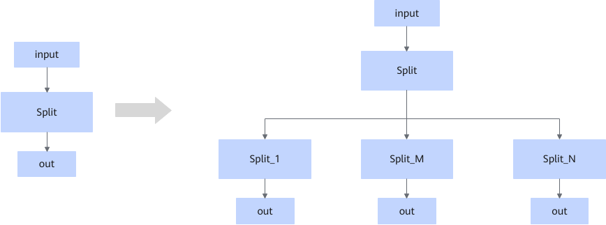

# ZSplitFusionPassV2

## 融合模式

将输出数量超限的Split节点拆分成多层级联的Split/SplitV节点结构。

均匀分割：

不均匀分割：

## 使用约束

- Split的num\_split超过最大输出限制时，该融合规则生效。
- 该融合规则不可关闭。

## 支持的型号

<!-- npu="910b" id1 -->
Atlas A2 训练系列产品/Atlas A2 推理系列产品
<!-- end id1 -->
