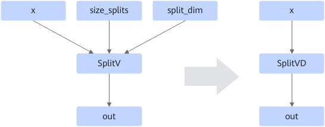

# ZSplitVDFusionPassV2

## 融合模式

该融合模式用在SplitV的size\_splits和split\_dim为常量时，将其融合成SplitVD，同时删除了size\_splits和split\_dim节点，将其变成SplitVD的属性，用于提升算子性能。

## 使用约束

无

## 支持的型号

<!-- npu="310p" id1 -->
Atlas 推理系列产品
<!-- end id1 -->

<!-- npu="310b" id2 -->
Atlas 200I/500 A2 推理产品
<!-- end id2 -->

<!-- npu="910" id3 -->
Atlas 训练系列产品
<!-- end id3 -->

<!-- npu="910b" id4 -->
Atlas A2 训练系列产品/Atlas A2 推理系列产品
<!-- end id4 -->

<!-- npu="A3" id5 -->
Atlas A3 训练系列产品/Atlas A3 推理系列产品
<!-- end id5 -->
