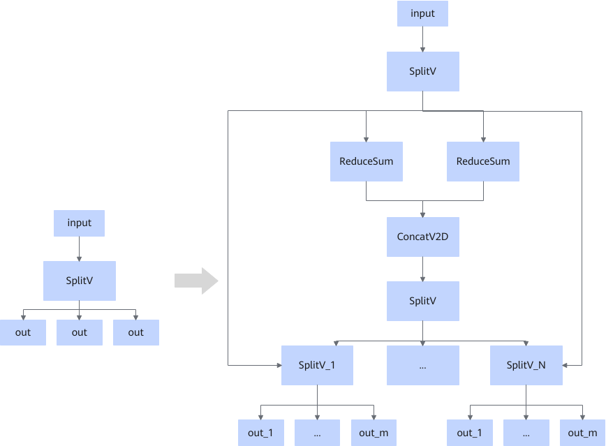

# ZSplitVFusionPass

## 融合模式

将输出数量超限的SplitV节点拆分成多层级联的SplitV节点结构。

当size\_splits输入是const时，融合模式如下：

当size\_splits输入不是const时，融合模式如下：

## 使用约束

- num\_split超过最大输出限制时，该融合规则生效，会拆分成多层级联的SplitV节点结构。
- num\_split不超过最大输出限制时，该融合规则不生效，保持原有的SplitV节点结构。
- 该融合规则不可关闭。

## 支持的型号

<!-- npu="910b" id1 -->
Atlas A2 训练系列产品/Atlas A2 推理系列产品
<!-- end id1 -->
