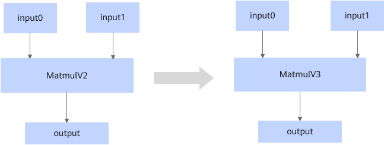

# ZZMatMulToMatmulV3FusionPass

## 融合模式

该融合将符合图融合pattern的MatmulV2的算子转换为MatmulV3算子。

## 使用约束

有以下情况之一则该融合规则不生效：

- 平台不支持l0c2out、不支持out2l1\_nd2nz、支持l0c2ub、支持fix\_pipe\_l0c2ub。
- 输入输出任一维度小于2维、动态shape、输入输出dtype非float16/bf16/float32。

## 支持的型号

<!-- npu="910b" id1 -->
Atlas A2 训练系列产品/Atlas A2 推理系列产品
<!-- end id1 -->
