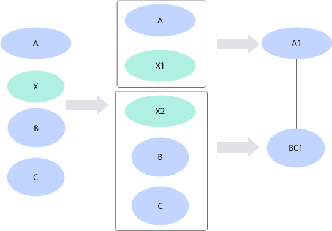

# 简介

## 概述

算子融合是整网性能提升的一种关键手段，包括图融合和UB融合。

图融合是整网性能提升的一种关键手段。

系统内置了一些图融合和UB融合规则，均为默认开启且能关闭的（如有其他情况，会特殊说明）。当前文档仅对这部分融合规则进行介绍。

>[!NOTE] 说明
>本文档涉及到的算子具体信息请参考《算子库》中的“[Ascend IR算子规格说明](https://www.hiascend.com/document/detail/zh/CANNCommunityEdition/latest/API/aolapi/operatorlist_00094.html)”章节。

## 图融合

客户在使用图方式描述网络时，采用与硬件无关的融合优化，实现算子性能提升。

图融合是根据融合规则进行改图的过程。图融合通过融合后算子替换图中融合前算子，提升计算效率。图融合的场景如下：

- 在某些算子的数学计算量可以进行优化的情况下，可以进行图融合，融合后可以节省计算时间。例如：conv+biasAdd，可以融合为一个算子，直接在L0C中完成累加，从而省去add的计算过程。
- 在融合后的计算过程中可以通过硬件指令加速的情况下，可以进行图融合，融合后能够加速。例如：conv+biasAdd的累加过程，就是通过L0C中的累加功能进行加速的，可以通过图融合完成。

图融合包括：图融合、图拆分融合。

- 图融合：对图上算子进行数学相关的融合，将多个算子融合为一个或者几个算子，该融合与硬件无关。

    如图1所示，conv2D和Batchnorm算子进行融合，经过数学公式的推导，将Batchnorm作用到conv2D上，融合成了conv2D算子。

    **图 1**  原图融合示例
    

- 拆分融合：将一个算子拆分成多个算子，并将拆分后的多个算子分别和其他算子进行融合。

    如图2所示，算子X被拆分成X1和X2两个算子，X1和A进行融合，融合成A1，X2和B、C进行融合，融合成BC1。

    **图 2**  拆分融合
    

## UB融合

客户在使用图方式描述网络时，经过图编译对图进行UB融合优化，实现硬件相关的融合优化，提升算子执行性能。

UB即AI处理器上的Unified Buffer，UB融合是对图上算子进行硬件UB相关的融合。例如两个算子单独运行时，算子1的计算结果在UB上，需要搬移到DDR。算子2在执行时，需要将算子1的输出由DDR再搬移到UB，进行算子2的计算逻辑，计算完之后，又从UB搬移回DDR。

从这个过程会发现算子1的结果从UB-\>DDR-\>UB-\>DDR。这个经过DDR进行数据搬移的过程是浪费的，因此将算子1和算子2合并成一个算子，融合后算子1的数据直接保留在UB，算子2从UB直接获取数据进行算子2的计算，节省了一次输出DDR和一次输入DDR，省去了数据搬移的时间，提高运算效率，有效降低带宽。

## 如何关闭/开启融合规则

用户可以在模型编译时，提前识别是否需要关闭/开启某些融合规则，以提升编译性能。方法如下：

- ATC模型转换时，通过--fusion\_switch\_file配置融合开关配置文件路径以及文件名。示例：

    ```bash
    --fusion_switch_file=/home/fusion_switch.cfg
    ```

- IR模型构建时，通过FUSION\_SWITCH\_FILE配置融合开关配置文件路径以及文件名。示例：

    ```c++
    std::map<AscendString, AscendString> global_options = {
            {ge::ir_option::FUSION_SWITCH_FILE, "/home/fusion_switch.cfg"},
        };
    auto status = aclgrphBuildInitialize(global_options);
    ```

- 模型训练和在线推理时，通过fusion\_switch\_file配置融合开关配置文件路径以及文件名。示例：

    ```bash
    custom_op.parameter_map["fusion_switch_file"].s = tf.compat.as_bytes("/home/fusion_switch.cfg")
    ```

其中，传入的_fusion\_switch.cfg_文件需要用户自己创建，文件名自定义，文件内容示例如下，on表示开启，off表示关闭。

```json
{
    "Switch":{
        "GraphFusion":{
            "ConvToFullyConnectionFusionPass":"on",
            "SoftmaxFusionPass":"on",
            "ConvConcatFusionPass":"on",
            "MatMulBiasAddFusionPass":"on",
            "PoolingFusionPass":"on",
            "ZConcatv2dFusionPass":"on",
            "ZConcatExt2FusionPass":"on"
        },
        "UBFusion":{
            "FusionVirtualOpSetSwitch":"on"
        }
    }
}
```

同时支持用户一键关闭融合规则，关闭示例如下。

```json
{
    "Switch":{
        "GraphFusion":{
            "ALL":"off"
        },
        "UBFusion":{
            "ALL":"off"
         }
    }
}
```

需要注意的是：

1. 以上关闭融合规则仅是关闭系统部分融合规则，而不是全部融合规则，原因是关闭某些融合规则可能会导致功能问题。
2. 文档中的融合规则默认状态为开启，因此一键式配置"ALL":"on"是无效操作。
3. 一键式关闭融合规则的同时，可以开启部分融合规则（即配置文件中针对单个融合规则的配置优先级高于"ALL"）。

    ```json
    {
        "Switch":{
            "GraphFusion":{
                "ALL":"off",
                "SoftmaxFusionPass":"on"
            },
            "UBFusion":{
                "ALL":"off",
                "FusionVirtualOpSetSwitch":"on"
            }
        }
    }
    ```

## 如何查看融合规则执行顺序

模型运行完成后，用户可以通过日志查看融合规则执行顺序。步骤如下。

1. 进入日志落盘路径。

    默认设置为 $HOME/ascend/log/debug/plog/。该路径可以通过ASCEND\_PROCESS\_LOG\_PATH指定，详细信息请参考《[日志参考](https://www.hiascend.com/document/detail/zh/CANNCommunityEdition/latest/maintenref/logreference/docs/zh/log_ref/log_overview.md)》。

    **cd $HOME/ascend/log/debug/plog/**

2. 查看已生效的图融合规则。

    **cat \* | grep "GraphId" | grep -v "effected\_times=0" | grep "effected\_times="**

    输出信息示例如下，其中effected\_times表示图融合规则生效次数。

    ```text
    [INFO] GE(3675829,atc.bin):2025-04-10-20:10:58.288.365 [pattern_fusion_base_pass.cc:259]3675829 RunOnePattern:GraphId[0], GraphFusionPass[TfTagNoConstFoldingFusionPass]: pattern=tfTagNoConstFoldingFusion1, matched_times=2, effected_times=2.
    [INFO] GE(3675829,atc.bin):2025-04-10-20:10:58.409.757 [pattern_fusion_base_pass.cc:259]3675829 RunOnePattern:GraphId[0], GraphFusionPass[TfMergeWeightQuantFusionPass]: pattern=tfMergeWeightQuantFusion0, matched_times=2, effected_times=2.
    [INFO] GE(3675829,atc.bin):2025-04-10-20:10:58.909.250 [pattern_fusion_base_pass.cc:259]3675829 RunOnePattern:GraphId[0], GraphFusionPass[Conv2DQuantProcessFusionPass]: pattern=Conv2DQuantProcessFusion, matched_times=2, effected_times=2.
    [INFO] GE(3675829,atc.bin):2025-04-10-20:10:58.910.555 [pattern_fusion_base_pass.cc:259]3675829 RunOnePattern:GraphId[0], GraphFusionPass[V200NotRequantFusionPass]: pattern=notRequantPassPattern1, matched_times=2, effected_times=2.
    [INFO] GE(3675829,atc.bin):2025-04-10-20:10:58.910.644 [pattern_fusion_base_pass.cc:259]3675829 RunOnePattern:GraphId[0], GraphFusionPass[V200NotRequantFusionPass]: pattern=notRequantPassPattern2, matched_times=2, effected_times=2.
    [INFO] GE(3675829,atc.bin):2025-04-10-20:10:58.910.782 [pattern_fusion_base_pass.cc:259]3675829 RunOnePattern:GraphId[0], GraphFusionPass[DeleteNoConstFolding]: pattern=deleteNoConstFoldingFusion0, matched_times=2, effected_times=2.
    [INFO] GE(3675829,atc.bin):2025-04-10-20:10:58.940.829 [pattern_fusion_base_pass.cc:259]3675829 RunOnePattern:GraphId[0], GraphFusionPass[ZConcatExt2FusionPass]: pattern=ConcatExt2FusionPass, matched_times=1, effected_times=1.
    [INFO] GE(3675829,atc.bin):2025-04-10-20:10:58.943.310 [pattern_fusion_base_pass.cc:259]3675829 RunOnePattern:GraphId[0], GraphFusionPass[ZSplitVDFusionPassV2]: pattern=SplitVDFusionPassV2, matched_times=1, effected_times=1.
    [INFO] GE(3675829,atc.bin):2025-04-10-20:10:58.943.398 [pattern_fusion_base_pass.cc:259]3675829 RunOnePattern:GraphId[0], GraphFusionPass[ZSplitVDFusionPass]: pattern=SplitVDFusionPass, matched_times=1, effected_times=1.
    [INFO] GE(3675829,atc.bin):2025-04-10-20:10:58.946.086 [pattern_fusion_base_pass.cc:259]3675829 RunOnePattern:GraphId[0], GraphFusionPass[SplitConvConcatFusionPass]: pattern=SplitConvConcatFusionPass, matched_times=1, effected_times=1.
    [INFO] GE(3675829,atc.bin):2025-04-10-20:10:59.079.485 [pattern_fusion_base_pass.cc:259]3675829 RunOnePattern:GraphId[0], GraphFusionPass[FixPipeAbilityProcessPass]: pattern=FixPipeAbilityProcessPass, matched_times=2, effected_times=2.
    ```

    >[!NOTE] 说明
    >- 日志中打印的融合规则顺序即为它们的实际执行顺序。
    >- 也可以通过**cat \* | grep "GraphId" | grep "effected\_times="**查看所有匹配过的图融合规则。

3. 查看UB融合规则的执行顺序。

    **cat \* |grep "Run buffer fusion pass successfully, pass name"**

    输出信息示例如下。日志中打印的融合规则顺序即为它们的实际执行顺序，如下融合规则是否生效请查看fusion\_result.json。

    ```text
    [INFO] FE(2018559,tc_ge_irrun_static_ifa_0003.bin):2025-06-09-09:55:36.632.602 [buffer_fusion.cc:135]2018968 RunRegisterBufferFusionPass:"Run buffer fusion pass successfully, pass name:TbeAippConvReluMaxpoolingFusion."
    [INFO] FE(2018559,tc_ge_irrun_static_ifa_0003.bin):2025-06-09-09:55:36.632.761 [buffer_fusion.cc:135]2018968 RunRegisterBufferFusionPass:"Run buffer fusion pass successfully, pass name:TbeAippConv2dAddRelu6MulMulFusionPass."
    [INFO] FE(2018559,tc_ge_irrun_static_ifa_0003.bin):2025-06-09-09:55:36.632.803 [buffer_fusion.cc:135]2018968 RunRegisterBufferFusionPass:"Run buffer fusion pass successfully, pass name:BatchMatmulV2DequantMulAddFusionPass."
    [INFO] FE(2018559,tc_ge_irrun_static_ifa_0003.bin):2025-06-09-09:55:36.632.854 [buffer_fusion.cc:135]2018968 RunRegisterBufferFusionPass:"Run buffer fusion pass successfully, pass name:TbeBatchMatmulQuantFusionPass."
    [INFO] FE(2018559,tc_ge_irrun_static_ifa_0003.bin):2025-06-09-09:55:36.632.957 [buffer_fusion.cc:135]2018968 RunRegisterBufferFusionPass:"Run buffer fusion pass successfully, pass name:TbeFullyconnectionElemwiseDequantFusionPass."
    [INFO] FE(2018559,tc_ge_irrun_static_ifa_0003.bin):2025-06-09-09:55:36.632.988 [buffer_fusion.cc:135]2018968 RunRegisterBufferFusionPass:"Run buffer fusion pass successfully, pass name:TbeFifoMatMulFusionPass."
    [INFO] FE(2018559,tc_ge_irrun_static_ifa_0003.bin):2025-06-09-09:55:36.633.036 [buffer_fusion.cc:135]2018968 RunRegisterBufferFusionPass:"Run buffer fusion pass successfully, pass name:TbeMatmulFixPipeFusionPass."
    [INFO] FE(2018559,tc_ge_irrun_static_ifa_0003.bin):2025-06-09-09:55:36.633.075 [buffer_fusion.cc:135]2018968 RunRegisterBufferFusionPass:"Run buffer fusion pass successfully, pass name:ATbeMatmulElemwiseFusionPass."
    [INFO] FE(2018559,tc_ge_irrun_static_ifa_0003.bin):2025-06-09-09:55:36.633.100 [buffer_fusion.cc:135]2018968 RunRegisterBufferFusionPass:"Run buffer fusion pass successfully, pass name:BatchMatmulConfusiontransposeUbFusion."
    ```
