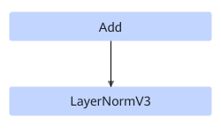

# AddLayerNormV3FusionPass 

## 融合模式

该融合规则将RealDiv+Add+LayerNormV3结构或者Add+LayerNormV3结构进行UB融合。

或者

## 使用约束

- 仅支持Atlas 推理系列加速卡产品上静态场景，格式为ND，其他不支持；
- 仅支持LayerNormV3尾轴为320/640/768/1024/1280/1536场景；

## 支持的型号

<!-- npu="310p" id1 -->
Atlas 推理系列产品
<!-- end id1 -->
