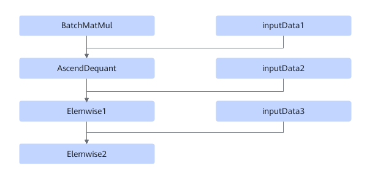

# BatchMatMulV2DequantMulAddFusionPass

## 融合模式

该融合将满足如下Pattern关系的子图中BatchMatMul+Elemwise+AscendDequant节点进行UB融合。

## 使用约束

上图中节点BatchMatMul，Elemwise1，Elemwise2为算子类型，其中节点BatchMatMul包括算子BatchMatMul，BatchMatmulV2，节点Elemwise1为Mul，节点Elemwise2为Add。

## 支持的型号

<!-- npu="310b" id1 -->
Atlas 200I/500 A2 推理产品
<!-- end id1 -->

<!-- npu="310p" id2 -->
Atlas 推理系列产品
<!-- end id2 -->

<!-- npu="910" id3 -->
Atlas 训练系列产品
<!-- end id3 -->
