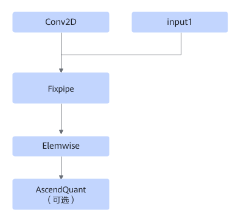

# Conv2DDequantClipByValueFusionPass

## 融合模式

该融合将Conv2D + AscendDequant（可选） + ClipByValue + AscendQuant（可选）算子融合成一个融合算子。

或者

## 使用约束

对于第二种pattern结构，Elemwise个数为1-3个，第一个Elemwise算子必须是ClipByValue类型，后两个Elemwise算子类型为Relu或Add。

ClipByValue算子的input channel需为16的整数倍大小。

## 支持的型号

<!-- npu="310b" id1 -->
Atlas 200I/500 A2 推理产品
<!-- end id1 -->

<!-- npu="310p" id2 -->
Atlas 推理系列产品
<!-- end id2 -->

<!-- npu="910" id3 -->
Atlas 训练系列产品
<!-- end id3 -->
