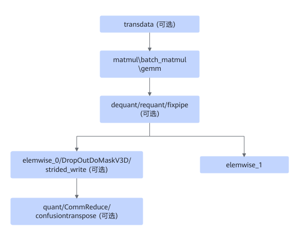

# MatmulGeneralizedUbFusion

## 融合模式

该融合将对满足如下模式（pattern）关系的子图进行UB融合。

融合成

## 使用约束

无

## 支持的型号

<!-- npu="310p" id1 -->
Atlas 推理系列产品
<!-- end id1 -->

<!-- npu="310b" id2 -->
Atlas 200I/500 A2 推理产品
<!-- end id2 -->

<!-- npu="910" id3 -->
Atlas 训练系列产品
<!-- end id3 -->
