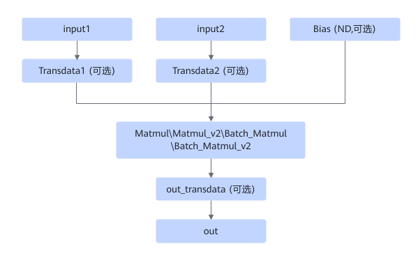
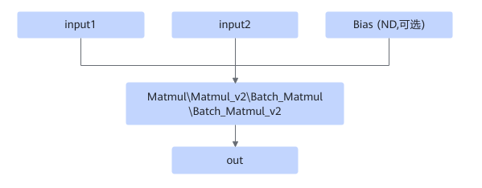

# MatmulTransdataFusionPass

## 融合模式

该融合将满足如下Pattern关系的子图进行UB融合。

融合成

## 使用约束

- 至少两个输入，bias可选，必须为ND格式。
- Transdata1和Transdata2输入为ND，输出为NZ。out\_transdata输入为NZ，输出为ND。
- 不支持静态和非对齐场景。
- 仅支持fp16进，fp16出。

## 支持的型号

<!-- npu="310p" id1 -->
Atlas 推理系列产品
<!-- end id1 -->

<!-- npu="310b" id2 -->
Atlas 200I/500 A2 推理产品
<!-- end id2 -->

<!-- npu="910" id3 -->
Atlas 训练系列产品
<!-- end id3 -->
