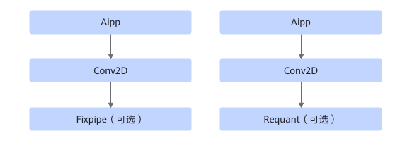

# TbeAippCommonFusionPass

## 融合模式

该融合将满足如下Pattern关系的子图中Aipp+Conv2D+Fixpipe（可选）或Requant（可选）对应节点进行UB融合。

Fixpipe或Requant最多支持1个。

## 使用约束

- Conv2D算子， strides = \[1, 1\]，pad = \[0, 0, 0, 0\]，kernel 1x1的场景不开启融合。
- Aipp开启resize，不开启融合。
- Aipp mode为dynamic，不开启融合。
- Aipp的input format设置为\["RGB16", "RGB20", "RGB24","RGB8\_IR", "RGB16\_IR","RGB24\_IR"\]中的一种时，不开启融合。
- Aipp开启padding时，不开启融合。
- 若Conv2D算子开启DMA，不支持融合。
- 若给出最小Tiling，L1仍无法容纳AIPP处理结果，则放弃融合。
- 若卷积的kernel H小于或者等于上下任意一个方向的Conv2d pad与AIPP pad之和，则放弃融合。

## 支持的型号

<!-- npu="310b" id1 -->
Atlas 200I/500 A2 推理产品
<!-- end id1 -->

<!-- npu="310p" id2 -->
Atlas 推理系列产品
<!-- end id2 -->

<!-- npu="910" id3 -->
Atlas 训练系列产品
<!-- end id3 -->
