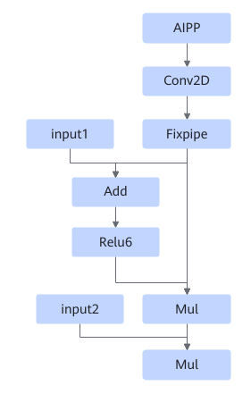
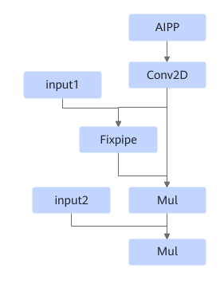

# TbeAippConv2dAddRelu6MulMulFusionPass

## 融合模式

该融合规则将满足如下Pattern的结构融合成一个融合算子。

或者

或者

或者

或者

## 使用约束

- Conv2D算子， strides = \[1, 1\], pad = \[0, 0, 0, 0\],  kernel 1\*1的场景不开启融合。
- AIPP开启resize，不开启融合。
- AIPP mode为dynamic，不开启融合。
- AIPP开启padding时，不开启融合。
- 若Conv2D算子启用DMA，不支持融合。
- 若给出最小Tiling，L1仍无法容纳Aipp处理结果，则放弃融合。
- 若卷积的kernel H小于或者等于上下任意一个方向的Conv2d pad与AIPP pad之和，则放弃融合。

## 支持的型号

<!-- npu="310p" id1 -->
Atlas 推理系列产品
<!-- end id1 -->

<!-- npu="310b" id2 -->
Atlas 200I/500 A2 推理产品
<!-- end id2 -->

<!-- npu="910" id3 -->
Atlas 训练系列产品
<!-- end id3 -->
