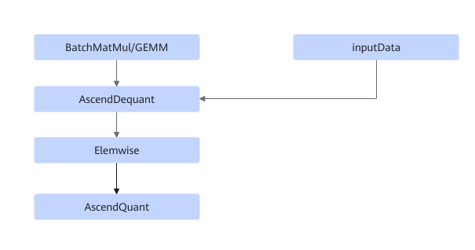
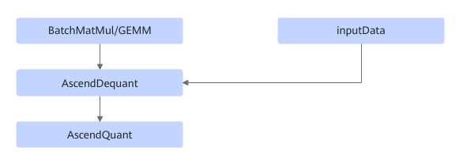

# TbeBatchMatMulQuantFusionPass

## 融合模式

该融合将满足如下Pattern关系的子图中BatchMatMul/GEMM和AscendDequant/AscendQuant/Elemwise进行UB融合。

模式一：

模式二：

## 使用约束

- BatchMatMul支持MatMul，MatMulV2，BatchMatMul，BatchMatMulV2。
- 不支持动态shape场景。
- Elemwise节点必须是FastGeluV2。

## 支持的型号

<!-- npu="310b" id1 -->
Atlas 200I/500 A2 推理产品
<!-- end id1 -->

<!-- npu="310p" id2 -->
Atlas 推理系列产品
<!-- end id2 -->

<!-- npu="910" id3 -->
Atlas 训练系列产品
<!-- end id3 -->
