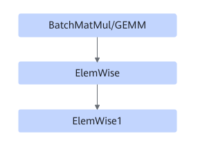
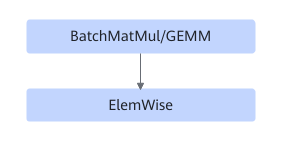

# TbeBatchMatmulElementWiseFusionPass

## 融合模式

该融合将满足如下Pattern关系的子图中BatchMatMul/GEMM和ElemWise进行UB融合。

模式一：

模式二：

模式三：

## 使用约束

- 不支持动态shape。
- 模式一Elemwise只支持FusedMulAdd，Add，Div，RealDiv，Relu，ReluGrad，Elemwise1只支持Add，Relu，FusedMulAdd。
- 模式二Elemwise只支持FusedMulAdd，Add，Div，RealDiv，Relu，ReluGrad。
- 模式三Elemwise只支持Mul，Elemwise1只支持Mul，Elemwise2只支持Sigmoid。
- BatchMatMul支持BatchMatMul，BatchMatMulV2。

## 支持的型号

<!-- npu="310b" id1 -->
Atlas 200I/500 A2 推理产品
<!-- end id1 -->

<!-- npu="310p" id2 -->
Atlas 推理系列产品
<!-- end id2 -->

<!-- npu="910" id3 -->
Atlas 训练系列产品
<!-- end id3 -->
