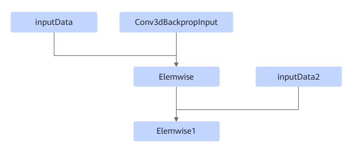

# TbeConv3dDxElemwisePass

## 融合模式

该融合将满足如下Pattern关系的子图中Conv3dBackpropInput和Elemwise进行UB融合。

或

或

## 使用约束

- 图中Elemwise只能为AddN；Elemwise1只能为LeakyReluGrad。
- 不支持动态shape场景。

## 支持的型号

<!-- npu="310p" id1 -->
Atlas 推理系列产品
<!-- end id1 -->

<!-- npu="910" id2 -->
Atlas 训练系列产品
<!-- end id2 -->
