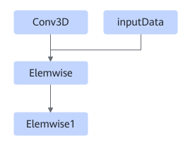
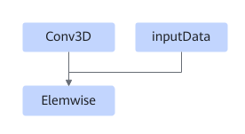

# TbeConv3dElemwisePass

## 融合模式

该融合将满足如下pattern关系的子图中Conv3D和Elemwise进行UB融合。

或者

或者

或者

## 使用约束

不支持动态shape场景。

支持4个pattern，对应上面4张示意图的场景：

1. 融合两个Elemwise算子，第一个只支持Add，第二个只支持Relu。
2. 融合一个Elemwise算子，并且Elemwise算子还有另外一路输入，Elemwise算子类型没有约束，并且支持AscendDequant和AscendRequant。
3. 融合一个Elemwise算子，Elemwise算子仅一路输入无其他输入，该场景只支持Relu。.
4. 融合三个Elemwise算子，第一个只支持AscendDequant，第二个只支持Add，第三个只支持Relu。该场景仅支持Atlas 推理系列产品。

## 支持的型号

<!-- npu="310p" id1 -->
Atlas 推理系列产品
<!-- end id1 -->

<!-- npu="910" id2 -->
Atlas 训练系列产品
<!-- end id2 -->
