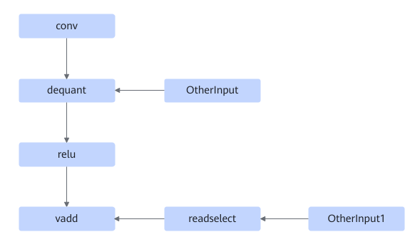
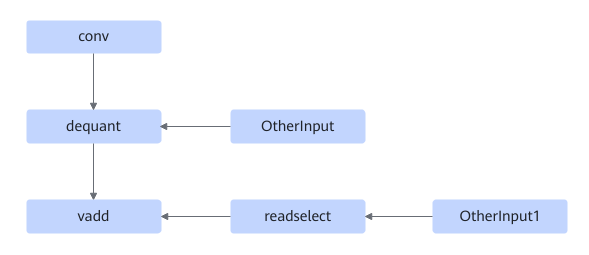

# TbeConvDequantVaddReluFusionPass

## 融合模式

该融合支持将以下三种融合模式融合成单个Conv2D融合算子。

或者

或者

## 使用约束

relu节点的匹配不支持prelu。

## 支持的型号

<!-- npu="310p" id1 -->
Atlas 推理系列产品
<!-- end id1 -->

<!-- npu="910" id2 -->
Atlas 训练系列产品
<!-- end id2 -->
