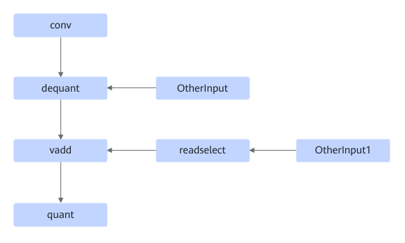
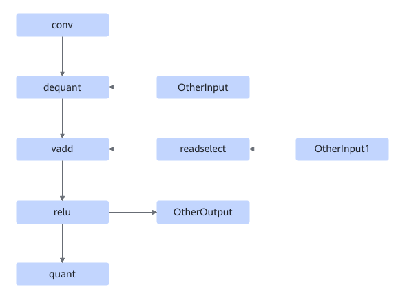
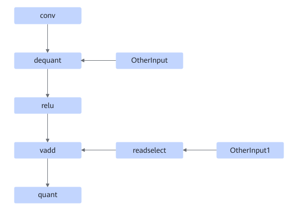
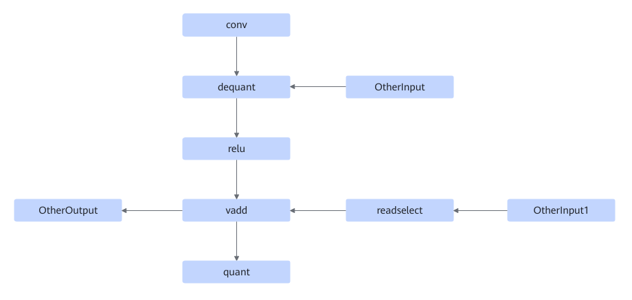

# TbeConvDequantVaddReluQuantFusionPass

## 融合模式

该融合支持将以下7种融合模式融合成单个conv2d融合算子。

或者

或者

或者

或者

或者

或者

## 使用约束

- vadd节点必须是Add算子。
- 在如下场景不要求readselect算子节点存在：
    - 融合pass匹配的节点中存在relu节点。
    - 出现多路Conv+Dequant节点，此时存在其他支路上Conv节点的Cin大于已匹配Conv节点的Cin，此时会重新匹配Cin更大的Conv+Dequant分支。

## 支持的型号

<!-- npu="310p" id1 -->
Atlas 推理系列产品
<!-- end id1 -->

<!-- npu="910" id2 -->
Atlas 训练系列产品
<!-- end id2 -->
