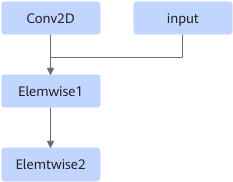

# TbeConvDoubleInFusionPass

## 融合模式

该融合将Conv2D + Elemwise + Elemwise算子融合成1个Conv2D融合算子。

## 使用约束

该融合目前只支持节点格式为NCHW，NHWC和HWCN三种格式。

该融合的Elemwise2算子只能支持一路来自于Elemwise1的输入。

## 支持的型号

<!-- npu="310b" id1 -->
Atlas 200I/500 A2 推理产品
<!-- end id1 -->

<!-- npu="310p" id2 -->
Atlas 推理系列产品
<!-- end id2 -->

<!-- npu="910" id3 -->
Atlas 训练系列产品
<!-- end id3 -->
