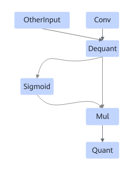

# TbeConvSigmoidMulQuantFusionPass

## 融合模式

该融合将Conv+Sigmoid+Mul+Quant算子融合成一个融合算子。

或者

## 使用约束

无。

## 支持的型号

<!-- npu="310b" id1 -->
Atlas 200I/500 A2推理产品
<!-- end id1 -->

<!-- npu="310p" id2 -->
Atlas推理系列产品
<!-- end id2 -->

<!-- npu="910" id3 -->
Atlas训练系列产品
<!-- end id3 -->
