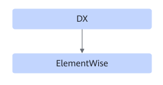

# TbeDxElemwisePass

## 融合模式

该融合将满足DX+ElementWise进行UB融合。

## 使用约束

- ElementWise支持Relu，LeakyRelu，PRelu，Add。
- DX支持Conv2DBackpropInputD，Conv2DTransposeD，Deconvolution。
- 该UB融合适用DX非量化场景，主要和ElementWise融合。
- 该UB融合不支持动态场景。

## 支持的型号

<!-- npu="310p" id1 -->
Atlas 推理系列产品
<!-- end id1 -->

<!-- npu="310b" id2 -->
Atlas 200I/500 A2 推理产品
<!-- end id2 -->

<!-- npu="910" id3 -->
Atlas 训练系列产品
<!-- end id3 -->
