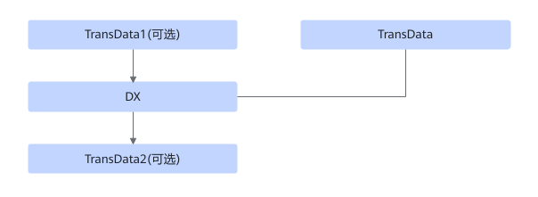

# TbeDxTransdataFusionPass

## 融合模式

该融合将满足TransData（可选）+TransData+DX+TransData（可选）进行UB融合。

## 使用约束

只支持DX为Conv2DBackpropInput，并且属性groups=1, dilations=\{1,1,1,1\}的动态场景。

该UB融合适用于非量化场景。

TransData1的输入格式为NC1HWC0，输出格式为NCHW或NHWC。

TransData2的输入格式为NCHW或NHWC，输出格式为NC1HWC0。

## 支持的型号

<!-- npu="310p" id1 -->
Atlas 推理系列产品
<!-- end id1 -->

<!-- npu="310b" id2 -->
Atlas 200I/500 A2 推理产品
<!-- end id2 -->

<!-- npu="910" id3 -->
Atlas 训练系列产品
<!-- end id3 -->
