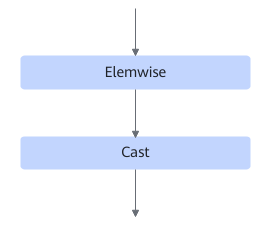

# TbeEltwiseCastFusionPass

## 融合模式

该融合将Elemwise类算子和Cast算子进行融合，具体可以分为如下四种场景。

场景一：

场景二：

场景三：

场景四：

## 使用约束

- Cast算子必须是float16转float32或者float32转float16。
- Elemwise类算子类型是"Relu", "Add", "Mul", "Sqrt"中的一种。
- other算子不参与融合，只参与匹配。
- 不支持动态shape场景。
