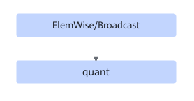
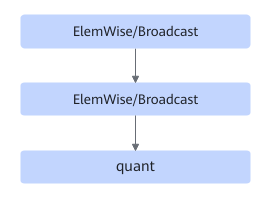

# TbeEltwiseQuantFusionPass

## 融合模式

该融合将满足如下Pattern关系的子图中ElemWise/Broadcast类和quant类节点进行UB融合。

或者

或者

## 使用约束

- ElemWise/Broadcast+ElemWise/Broadcast+quant场景中，ElemWise/Broadcast最多支持5个。
- 不支持动态shape场景。
