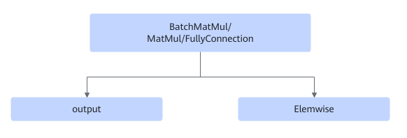
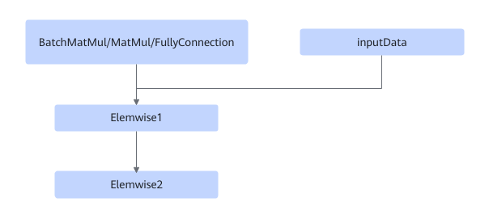

# TbeFullyconnectionElemwiseDequantFusionPass

## 融合模式

该融合将满足如下Pattern关系的子图中FullyConnection/MatMul/MatMulV2/BatchMatMul/BatchMatMulV2+ElemWise+AscendQuant+AscendDequant对应节点进行UB融合。

第5个Pattern中的虚线框代表这些节点可以没有匹配。

或

或

或

或

## 使用约束

- ElemWise2节点仅支持: Elu，LeakyRelu，Gelu，Softsign，Relu6，Relu，Softplus，Sigmoid，Tanh，Selu，GeluGrad，Add，AddN，FastGelu，FastGeluV2，FastGeluGrad，Eltwise，PRelu，Mul，Muls，Power，Relu6D，TanhGrad。
- 不支持动态shape场景。
- matmul/dequant/gelu/quant场景下，ElemWise1节点必须是Gelu，数据类型仅支持fp32。
- ElemWise2不为空时，ElemWise1必须是Relu，LeakyRelu，Add，Muls，AddN，ElemWise2必须为Relu6。
    - ElemWise1为Add时，Add输入node必须为2，输出node为1，且之前的节点为FullyConnection。
    - ElemWise1为LeakyRelu，需要有negative\_slope，negative\_slope绝对值要大于1.19209e-07。

- 不支持MatMul+ElemWise1为AddN或者Mul。
- BatchMatMul/BatchMatMulV2场景下不支持ElemWise2为Add或Relu。
- 当elemwise\_node type为add时，fc的输出形状不能小于add的输入形状。

## 支持的型号

<!-- npu="310b" id1 -->
Atlas 200I/500 A2 推理产品
<!-- end id1 -->

<!-- npu="310p" id2 -->
Atlas 推理系列产品
<!-- end id2 -->

<!-- npu="910" id3 -->
Atlas 训练系列产品
<!-- end id3 -->
