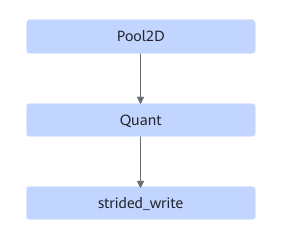

# TbePool2dQuantFusionPass

## 融合模式

该融合将Pool2D+Quant+strided\_write算子融合成一个融合算子。

## 使用约束

该融合中strided\_write会被优化，不可以单独关闭该融合规则。

## 支持的型号

<!-- npu="310p" id1 -->
Atlas 推理系列产品
<!-- end id1 -->

<!-- npu="910b" id2 -->
Atlas A2 训练系列产品/Atlas A2 推理系列产品
<!-- end id2 -->

<!-- npu="A3" id3 -->
Atlas A3 训练系列产品/Atlas A3 推理系列产品
<!-- end id3 -->
