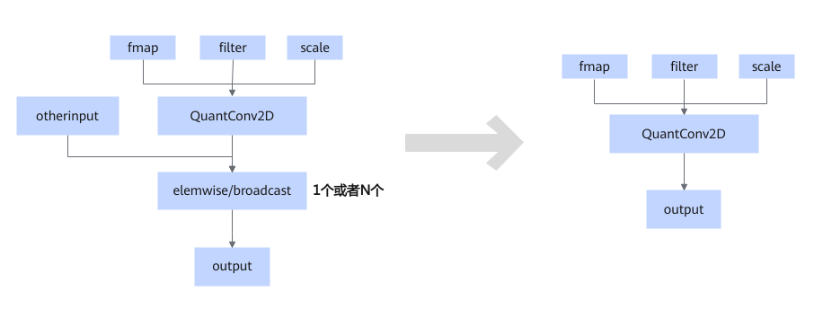

# TbeQuantConv2DElemWiseFusionPass

## 融合模式

将QuantConv2D和elemwise/broadcast节点进行UB融合。elemwise白名单为Add/Div/Realdiv。

## 使用约束

- 仅支持SD2.1和SDXL网络中涉及的级联结构，即静态场景下的QuantConv2D+Add，QuantConv2D+Add+Div和QuantConv2D+Add+Realdiv。
- 仅支持Atlas 推理系列产品静态场景。
- QuantConv2D节点有offset、group\>1、dma场景、Nx1不融合。
- elemwise只支持双输入、单输出，且需要满足静态白名单Add/Div/Realdiv，否则不融合。
- elemwise节点数量1<=N<=2，当N=2时，第一个elemwise不能是输出多引用，否则不融合。

## 支持的型号

<!-- npu="310p" id1 -->
Atlas 推理系列产品
<!-- end id1 -->
