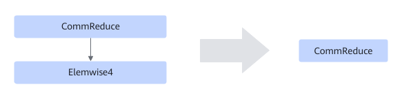

# TbeReduceElemwiseFusionPass

## 融合模式

该融合规则在静态shape场景下将如下pattern子图进行UB融合。

模式一：

模式二：

## 使用约束

- 当计算指令较多的算子（如cos，sin等）使用该融合规则时，可能存在编译时间过长问题，此时建议关闭该融合规则。
- **模式一的约束如下：**
    - 仅支持静态场景。
    - Elemwise1必须存在且数量为1。
    - CommReduce必须存在且数量为1。
    - Elemwise2、Elemwise3数量可以不存在，最多分别不超过5个。
    - Elemwise2、Elemwise3不支持为多输入节点。

- **模式二的约束如下：**
    - 仅支持静态场景。
    - CommReduce必须有且数量为1。
    - Elemwise4数量至少含有一个，最多不超过5。
    - Elemwise4不能为多输入节点。
