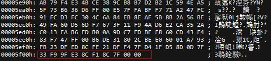

# JPEGD图片解码失败

## 问题现象描述

JPEGD模块解码失败，查看日志有类似如下报错信息：

日志信息（1）：

```bash
just support jpeg with YUV 444 422 420 400
do not support progressive mode
do not support arithmetic code, support huffman code only
```

日志信息（2）：

```bash
EOI segment of the stream is invalid
```

## 可能原因

分析上面日志信息，可能存在以下可能原因：

1. 数据格式不支持

    JPEGD只支持huffman编码\(colorspace: yuv, subsample: 444/422/420/400 \)，不支持算术编码，不支持渐进编码，不支持jpeg2000格式。

2. 图像数据不完整

## 处理步骤

针对上述可能原因，请按以下方式处理：

1. 针对目前不支持的超规格图像格式，建议用户自行使用第三方软件解码。
2. 针对图像数据不完整，根据报错提示，通过第三方软件查看原图像二进制进行确认。

    例如“EOI segment of the stream is invalid”或“EOI segment of the stream is invalid, it should be FFD9. Try software decoding.”报错，表示图像缺失最后的EOI结束符，对应图像二进制类似下图所示。正常JPEG图片最后应该由标记码FF D9结束，该数据最后缺失FF D9标记码。

    如果确认原图数据不完整，报错属于正常现象，需更换数据。

    

3. 如果原图像数据完整，可能数据在传输过程中存在损坏，需要在调用图片编码之前，通过fwrite函数将传输给JPEGD的码流保存下来，与原图进行二进制比较。如果不一致，传输过程出现数据缺失，需自行进一步定位传输过程数据缺失问题。
